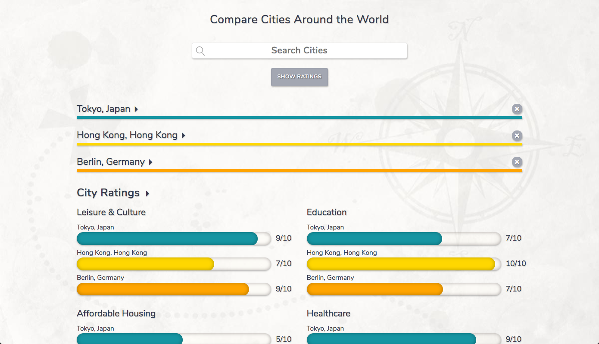
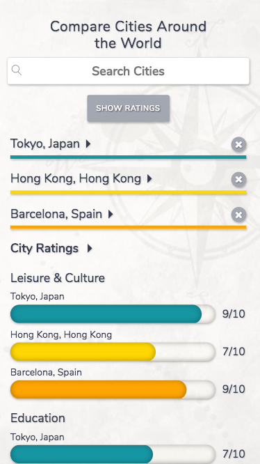

## My Kinda Town

This responsive web app was created to help prospective transplants make their next move by providing information about major cities around the world. Enter a city to get key metrics for that city. Enter more cities and compare your favorite picks side by side.

## How To Get Started

Type a city into the search bar and view ratings for that city on a scale from 0 to 10 for a number of key quality of life factors. Enter more cities to compare your favorites side by side.

[Get Started] (http://michaelsolorio.com/my-kinda-town/intro/index.html "Get Started")

## Technologies Used

- HTML
- CSS
- JavaScript
- jQuery
- Bootstrap's grid

## Technical Details

This app separates functionality that updates state and functionality that renders state.

