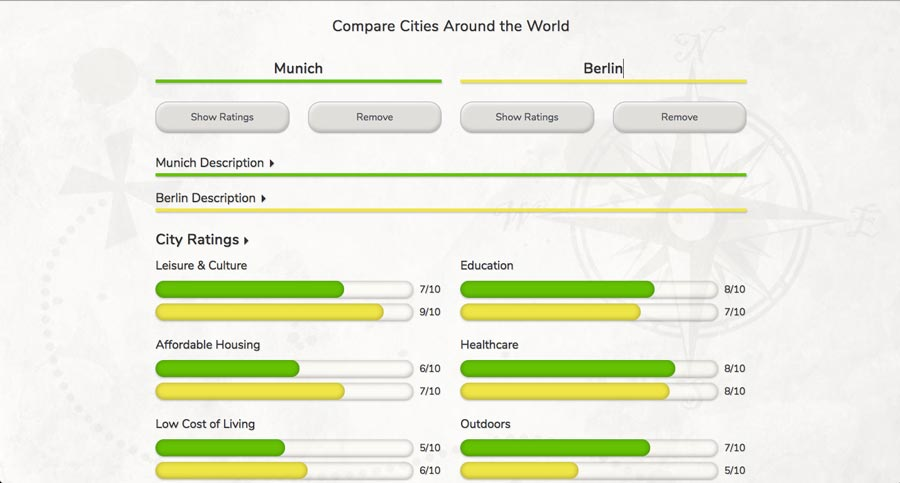

## My Kinda Town

This app aids prospective transplants in considering where they might like move by allowing them to access information about a city and compare cities side by side.

### Technologies Used

- HTML
- CSS
- JavaScript
- jQuery for asynchronous HTTP requests, DOM traversal, manipulation, and event listening
- Bootstrap's grid system for layout

